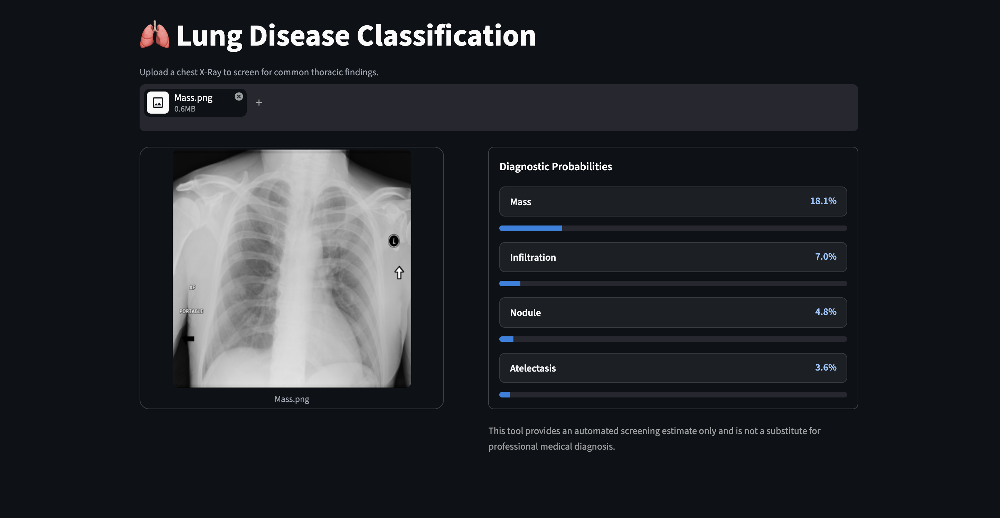
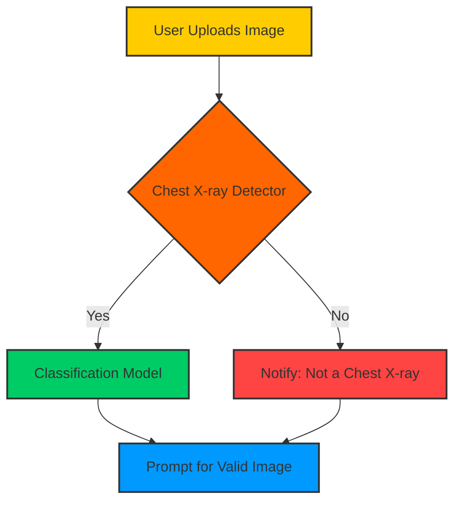

# 🫁 Lung Diseases Classification & Detection, Deep Learning Computer Vision

> **A robust, end‑to‑end solution** that classifies chest‑X‑ray diseases and first verifies that the uploaded image is actually a chest X‑ray. Built with TensorFlow, Streamlit, and optimized for Apple Silicon via TensorFlow‑Metal.

---



---

## 🏗️ Architecture & Flow Scheme



---

## 📂 Directory Structure

```text
Pneumonia Classification 🫁/
├── assets/                 # Images, icons, demo screenshots
├── data/                   # (optional) cached dataset & detector data
├── models/
│   ├── classifier/         # Trained disease classification model
│   │   ├── saved_model/    # TensorFlow SavedModel format
│   │   └── metadata.json
│   └── detector/           # Chest‑X‑ray detector model
│       ├── saved_model/
│       └── metadata.json
├── scripts/
│   ├── train_classifier.py # Training script for the disease model
│   ├── train_detector.py   # Training script for the detector
│   └── data_collection.py  # Automated internet image fetcher
├── main.py                 # Streamlit entry‑point
├── requirements.txt        # Python dependencies
├── environment.yml         # Conda environment (optional)
└── README.md               # **This file**
```

---

## 📄 File Details

| File | Description |
|------|-------------|
| [main.py](file:///Users/wess/Desktop/computer%20vision/Pneumonia%20Classifcation%20%E2%9C%8B/main.py) | Streamlit app: handles file upload, runs detector → classifier, and renders results. |
| [scripts/train_classifier.py](file:///Users/wess/Desktop/computer%20vision/Pneumonia%20Classifcation%20%E2%9C%8B/scripts/train_classifier.py) | Training pipeline for the disease classification model (NIH Chest X‑ray dataset). |
| [scripts/train_detector.py](file:///Users/wess/Desktop/computer%20vision/Pneumonia%20Classifcation%20%E2%9C%8B/scripts/train_detector.py) | Builds the binary chest‑X‑ray detector using mixed medical‑X‑ray data. |
| [scripts/data_collection.py](file:///Users/wess/Desktop/computer%20vision/Pneumonia%20Classifcation%20%E2%9C%8B/scripts/data_collection.py) | Scrapes random images from the web and aggregates non‑chest X‑ray samples. |
| [models/classifier/saved_model/](file:///Users/wess/Desktop/computer%20vision/Pneumonia%20Classifcation%20%E2%9C%8B/models/classifier/saved_model/) | TensorFlow SavedModel for disease classification (exported after training). |
| [models/detector/saved_model/](file:///Users/wess/Desktop/computer%20vision/Pneumonia%20Classifcation%20%E2%9C%8B/models/detector/saved_model/) | TensorFlow SavedModel for the chest‑X‑ray detector. |
| [requirements.txt](file:///Users/wess/Desktop/computer%20vision/Pneumonia%20Classifcation%20%E2%9C%8B/requirements.txt) | Pinpointed Python dependencies (TensorFlow‑Metal, Streamlit, Pillow, etc.). |
| [environment.yml](file:///Users/wess/Desktop/computer%20vision/Pneumonia%20Classifcation%20%E2%9C%8B/environment.yml) | Optional Conda environment for reproducibility. |
| [assets/](file:///Users/wess/Desktop/computer%20vision/Pneumonia%20Classifcation%20%E2%9C%8B/assets/) | Screenshots, logos, and UI mock‑ups used in this README. |

---

## 🧮 How It Works (Core Logic)

1. **Image Pre‑processing**
   - Uploaded image is resized to `224×224` and normalized to `[0, 1]`.
   - For the detector we use a **binary cross‑entropy** model; for the classifier we employ a **softmax** over disease classes.
2. **Chest‑X‑ray Detector**
   - A lightweight CNN (MobileNetV2 backbone) trained on a balanced set of chest‑X‑rays vs. other X‑ray / random images.
   - Decision threshold `0.5` → *Chest* vs *Non‑Chest*.
3. **Disease Classification Model**
   - Built on **EfficientNet‑B0** (pre‑trained on ImageNet) fine‑tuned on the NIH Chest X‑ray dataset.
   - Outputs probabilities for 14 disease categories; the top‑1 class is displayed.
4. **TensorFlow‑Metal Integration**
   - Running on macOS with Apple Silicon requires **Python 3.11** and `tensorflow-macos==2.13.*` + `tensorflow-metal` for GPU‑style acceleration.
5. **Streamlit UI**
   - `st.file_uploader` → detector → conditional display.
   - Visual feedback (loading spinners, success/error toasts) ensures a smooth UX.

---

## 🛠️ Setup & Requirements

### Prerequisites
- macOS (Apple Silicon preferred) ✅
- **Python 3.11** (required for TensorFlow‑Metal) 🐍
- Git (to clone the repo) 🌐

### Quick Start
```bash
# 1️⃣ Clone the repo
git clone "https://github.com/yourusername/pneumonia-classification.git"
cd "Pneumonia Classifcation 🫁"

# 2️⃣ Create a virtual environment (venv) – ensures isolation
python3.11 -m venv .venv
source .venv/bin/activate

# 3️⃣ Install dependencies (TensorFlow‑Metal pulls the metal backend)
pip install --upgrade pip
pip install -r requirements.txt

# 4️⃣ (Optional) Verify GPU acceleration
python -c "import tensorflow as tf; print(tf.config.list_physical_devices('GPU'))"

# 5️⃣ Launch the Streamlit app
streamlit run main.py
```

### Dependencies (excerpt from `requirements.txt`)
```
streamlit==1.38.0
tensorflow-macos==2.13.*
 tensorflow-metal==1.0.*
pillow==10.4.0
numpy==2.0.0
matplotlib==3.9.2
```

> **💡 Tip:** If you encounter `ImportError: No module named 'tensorflow'`, ensure you are using the **Python 3.11** interpreter inside the activated venv.

---

## 🎮 Controls / Usage

| Action | How to Perform |
|--------|----------------|
| **Upload Image** | Click the **"Browse files"** button or drag‑and‑drop an image onto the uploader area. |
| **View Detector Result** | After upload, a spinner appears. If the image is *not* a chest X‑ray, a red warning banner tells you to try again. |
| **Get Disease Prediction** | When the detector passes the image, the app shows the top disease with probability and a short description. |
| **Refresh** | Use the **"Rerun"** button (top‑right) to clear state and analyze a new image. |
| **Run Locally on GPU** | The app automatically leverages TensorFlow‑Metal on Apple Silicon. No extra flags needed. |

---

## 🙏 Acknowledgements & References
- **NIH Chest X‑ray Dataset** – https://nihcc.app.box.com/v/ChestXray-NIHCC
- **Kaggle GPU Accelerators** – helped shave weeks off training time.
- **TensorFlow‑Metal** – Apple’s metal‑based GPU backend for TensorFlow.
- **Streamlit** – Rapid UI prototyping for ML models.

---

*Built with ❤️ by *Wess* – feel free to open issues, submit PRs, or ask questions!*
