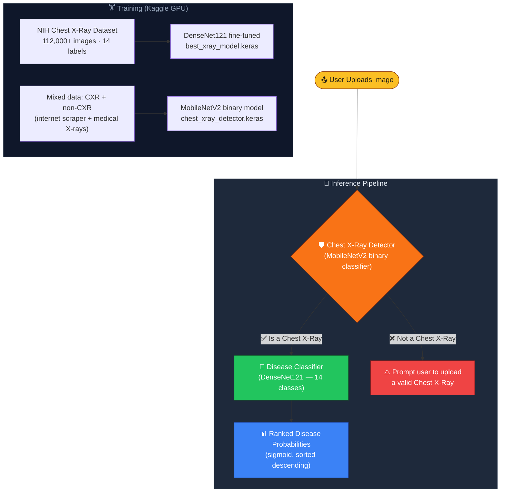

# 🫁 Lung Diseases Classification & Detection
### Deep Learning · Computer Vision · TensorFlow · Streamlit

> **An end‑to‑end AI pipeline** that first verifies whether an uploaded image is a genuine chest X‑ray, then classifies it into **14 thoracic disease categories** using two fine‑tuned deep learning models — deployed via an interactive Streamlit web app.

[](https://github.com/Wissem-Sahli-Engineer/Lung-Diseases-Detection-Classification-DeepLearning-ComputerVision)
[](https://www.python.org/)
[](https://developer.apple.com/metal/)
[](https://streamlit.io/)
[](https://nihcc.app.box.com/v/ChestXray-NIHCC)

---


---

## 🏗️ Architecture & Flow Scheme



---

## 📂 Directory Structure

```
🫁 Pneumonia Classifcation 🫁/
│
├── 🧠 models/
│   ├── 📦 best_xray_model.keras          ← Disease classifier  (DenseNet121, ~62 MB)
│   ├── 📦 chest_xray_detector.keras      ← CXR detector        (MobileNetV2, ~9 MB)
│   ├── 📁 best_xray_model/               ← Unpacked SavedModel folder
│   └── 🐍 diseases.py                    ← DISEASE_CLASSES constant (14 labels)
│
├── 📊 data/
│   ├── 🐍 Automated_Data.py              ← Internet image scraper for detector data
│   ├── 🐍 Data_Count.py                  ← Dataset stats / class balance checker
│   └── 📁 dataset/
│       ├── 📁 train/                     ← Training split (CXR vs non‑CXR)
│       └── 📁 val/                       ← Validation split
│
├── 📓 nih-chest-x-rays.ipynb             ← Classifier training notebook (Kaggle)
├── 📓 x-rays_detectors.ipynb             ← Detector training notebook
│
├── 🐍 main.py                            ← Streamlit app (simple layout)
├── 🐍 main_2.py                          ← Streamlit app (polished UI, base64 img panel)
├── 🐍 utils.py                           ← classify() + predict_if_cxr() helpers
│
├── 🖼️  app.png                            ← App screenshot (used in this README)
├── 🖼️  test_image.png                     ← Sample chest X‑ray for manual testing
├── 📄 requirements.txt                   ← Python dependencies
├── 🙈 .gitignore
└── 📖 README.md
```

---

## 📄 File Details

| Icon | File | Role |
|:----:|------|------|
| 🐍 | [main.py](file:///Users/wess/Desktop/computer%20vision/Pneumonia%20Classifcation%20%F0%9F%AB%81/main.py) | Minimal Streamlit entry‑point: upload → detect → classify → show results |
| 🐍 | [main_2.py](file:///Users/wess/Desktop/computer%20vision/Pneumonia%20Classifcation%20%F0%9F%AB%81/main_2.py) | Polished UI version: base64 image panel, fixed‑height side‑by‑side layout, result cards |
| 🐍 | [utils.py](file:///Users/wess/Desktop/computer%20vision/Pneumonia%20Classifcation%20%F0%9F%AB%81/utils.py) | `classify()` — DenseNet pre‑processing + prediction · `predict_if_cxr()` — binary CXR gate |
| 📦 | [models/best_xray_model.keras](file:///Users/wess/Desktop/computer%20vision/Pneumonia%20Classifcation%20%F0%9F%AB%81/models/best_xray_model.keras) | Fine‑tuned **DenseNet121** disease classifier (14 labels, sigmoid output) |
| 📦 | [models/chest_xray_detector.keras](file:///Users/wess/Desktop/computer%20vision/Pneumonia%20Classifcation%20%F0%9F%AB%81/models/chest_xray_detector.keras) | **MobileNetV2**-based binary detector — CXR vs non‑CXR |
| 🐍 | [models/diseases.py](file:///Users/wess/Desktop/computer%20vision/Pneumonia%20Classifcation%20%F0%9F%AB%81/models/diseases.py) | Single source of truth for the 14 `DISEASE_CLASSES` labels |
| 📓 | [nih-chest-x-rays.ipynb](file:///Users/wess/Desktop/computer%20vision/Pneumonia%20Classifcation%20%F0%9F%AB%81/nih-chest-x-rays.ipynb) | Full training pipeline for the classifier — data loading, augmentation, DenseNet fine‑tuning |
| 📓 | [x-rays_detectors.ipynb](file:///Users/wess/Desktop/computer%20vision/Pneumonia%20Classifcation%20%F0%9F%AB%81/x-rays_detectors.ipynb) | Detector training notebook — mixed dataset, binary cross‑entropy, MobileNetV2 |
| 🐍 | [data/Automated_Data.py](file:///Users/wess/Desktop/computer%20vision/Pneumonia%20Classifcation%20%F0%9F%AB%81/data/Automated_Data.py) | Automated scraper that pulls random internet images for the non‑CXR class |
| 🐍 | [data/Data_Count.py](file:///Users/wess/Desktop/computer%20vision/Pneumonia%20Classifcation%20%F0%9F%AB%81/data/Data_Count.py) | Counts samples per class across train/val splits — ensures balance |
| 📄 | [requirements.txt](file:///Users/wess/Desktop/computer%20vision/Pneumonia%20Classifcation%20%F0%9F%AB%81/requirements.txt) | `tensorflow · tensorflow-metal · pandas · scikit-learn · streamlit` |

---

## 🧮 How It Works (Core Logic)

### 1️⃣ Pre‑processing
| Step | Detail |
|------|--------|
| Resize | All images → `224 × 224` px to match training input |
| Normalize (Classifier) | `tf.keras.applications.densenet.preprocess_input()` — ImageNet mean subtraction |
| Normalize (Detector) | Raw `[0, 255]` float32 — preprocessing baked inside the model |
| Batch dim | `np.expand_dims(arr, axis=0)` → shape `(1, 224, 224, 3)` |

### 2️⃣ Chest X‑Ray Detector (`chest_xray_detector.keras`)
- **Backbone**: MobileNetV2 (lightweight, fast inference)
- **Head**: binary sigmoid output → `prediction ≥ 0.5` → **Chest X‑Ray**
- **Training data**: Balanced mix of genuine CXRs + diverse internet images + non‑chest medical X‑rays (collected via `data/Automated_Data.py`)
- **Purpose**: Acts as a hard gate — only valid CXRs proceed to classification

### 3️⃣ Disease Classifier (`best_xray_model.keras`)
- **Backbone**: **DenseNet121** pre‑trained on ImageNet, fine‑tuned on the NIH Chest X‑ray dataset (112,120 frontal‑view images)
- **Head**: Dense(14) with **sigmoid** activation → independent probability per disease
- **Output**: 14 probabilities sorted descending, displayed with progress bars
- **Labels**: Atelectasis · Cardiomegaly · Effusion · Infiltration · Mass · Nodule · Pneumonia · Pneumothorax · Consolidation · Edema · Emphysema · Fibrosis · Pleural_Thickening · Hernia

### 4️⃣ TensorFlow‑Metal (Apple Silicon)
- Requires **Python 3.11** + `tensorflow-metal` for GPU acceleration on macOS
- The app automatically detects and uses the Metal GPU backend — no flags needed

---

## 🛠️ Setup & Requirements

### Prerequisites
| Requirement | Version |
|-------------|---------|
| macOS (Apple Silicon) | M1 / M2 / M3 |
| Python | **3.11** ← required for TF‑Metal |
| Git | any recent version |

### ⚡ Quick Start

```bash
# 1. Clone the repository
git clone https://github.com/Wissem-Sahli-Engineer/Lung-Diseases-Detection-Classification-DeepLearning-ComputerVision.git
cd "Lung-Diseases-Detection-Classification-DeepLearning-ComputerVision"

# 2. Create & activate a Python 3.11 virtual environment
python3.11 -m venv .venv
source .venv/bin/activate

# 3. Install dependencies
pip install --upgrade pip
pip install -r requirements.txt

# 4. (Optional) Verify GPU is detected
python -c "import tensorflow as tf; print(tf.config.list_physical_devices('GPU'))"

# 5. Launch the polished Streamlit app
source .venv/bin/activate && streamlit run main_2.py

# or the minimal version:
source .venv/bin/activate && streamlit run main.py
```

### 📦 `requirements.txt`
```
tensorflow
tensorflow-metal
pandas
scikit-learn
streamlit
```

> **💡 Tip:** Always activate the venv first. If you see `No module named 'tensorflow'`, make sure you're using the Python 3.11 interpreter inside `.venv`.

---

## 🎮 Controls / Usage

| Action | How |
|--------|-----|
| **Upload an image** | Click **"Browse files"** or drag‑and‑drop a `.jpeg / .jpg / .png / .webp / .gif` file |
| **CXR Gate** | The detector runs automatically — if the image is not a chest X‑ray a red ⚠️ error banner appears |
| **View predictions** | 14 diseases are listed with their probability % and a visual progress bar, sorted by confidence |
| **Try another image** | Upload a new file; Streamlit re‑runs the full pipeline automatically |
| **GPU acceleration** | Happens transparently via TensorFlow‑Metal — no extra configuration needed |

---

## 🙏 Acknowledgements & References

- 🏥 **NIH Chest X‑Ray Dataset** — [nihcc.app.box.com](https://nihcc.app.box.com/v/ChestXray-NIHCC) · 112,120 frontal‑view X‑rays, 14 disease labels
- ⚡ **Kaggle GPU Accelerators** — Used for training both models (significantly reduced training time)
- 🍎 **TensorFlow‑Metal** — Apple's GPU backend for TensorFlow on macOS
- 🌐 **Streamlit** — Rapid ML app prototyping and deployment

---

<div align="center">

*Built with ❤️ by **Wess** — feel free to open issues, submit PRs, or ask questions!*

[](https://github.com/Wissem-Sahli-Engineer/Lung-Diseases-Detection-Classification-DeepLearning-ComputerVision)

</div>
